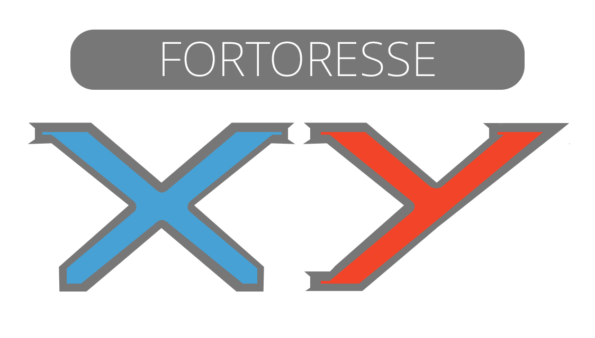

  

Fortoresse XY is a free world, 2D shooter multiplayer game in early development.

## Origins

Fortoresse XY has its roots from the original Fortoresse game by the Atelier 801 company. There are several differences planned:

* Crossing endpoints of a level would lead to another level.
* Pixel buildings would be substituted by higher buildings, such as breakable shields and slopes.

Planned features:

* Native servers
* User servers
  * Scripting

## Discussions

Use the [discussion forum](https://github.com/hydroper/fortoresseXY/discussions) available in this repository to discuss and share ideas.

## Client side

The client side is currently empty, but will use:

* [Samsung HARMAN AIR](https://airsdk.dev)
  * The AIR SDK overlay is overlaid into the Apache Flex SDK.
  * AIR supports native WebSocket as of 2024. [Download AIR SDK 51.0.](https://airsdk.harman.com/download/51.0.0.2)
* [Feathers UI](https://feathersui.com) — OpenFL SWC for ActionScript 3

Expected tools:

* Adobe Animate for graphics assets.

Client side reconsiderations:

* No use of Apache Flex or Apache Royale, given that both are not priorized over the Feathers UI project by Josh Tynjala. The reason is that Josh builds a SWC for every Feathers UI release, which is compatible with AIR applications written in ActionScript 3.

## Server side

The server side uses Node.js and is still beginning.

*Database*: undecided.